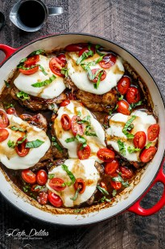

# balsamic glazed caprese chicken

BALSAMIC GLAZED CAPRESE CHICKEN

[PRINT](https://cafedelites.com/easyrecipe-print/25074-0/)

Caprese Chicken cooked right in a sweet, garlic balsamic glaze with juicy cherry tomatoes, fresh basil and topped with melted mozzarella cheese!

ORIGINAL RECIPE BY KARINA, CAFEDELITES ©[/b]
Author: Karina - Cafe Delites
Serves: 6

INGREDIENTS
* 6 skinless, bone-in chicken thighs
* 1 teaspoon dried oregano*
* 1 teaspoon dried basil*
* 1 teaspoon saltcracked black pepper, to taste
* 1 tablespoon olive oil (or a light spray of cooking oil spray)
* 2 tablespoons minced garlic
* ⅓ cup balsamic vinegar
* 2½ tablespoons brown sugar, packed
* 1½ cups grape or cherry tomatoes, divided
* 250 g | 8 oz. fresh mozzarella cheese (or Bocconcini), cut into 6x ½-inch slices**
* ¼ cup fresh basil leaves, chiffonade
Balsamic Glaze: (Optional To Serve)
* ⅓ cup balsamic vinegar
* 2 tablespoons brown sugar, packed
*

*

INSTRUCTIONS

Report this ad

1. Preheat oven to 410°F.
2. Season each chicken thigh with the oregano, basil, salt and pepper.
3. Heat the oil (or cooking spray) in a large oven-proof pan or skillet over medium-high heat. Sear the chicken on both sides until golden brown, about 4 minutes each side. Transfer chicken to a plate; drain most of the excess oil, leaving about a teaspoon worth.
4. Return the skillet back to the stove; fry garlic until fragrant (about 1 minute). Add the vinegar and brown sugar; stirring to combine while heating through. Bring to a simmer, while stirring occasionally, until glaze has thickened (about 5-6 minutes).
5. Return the chicken to the pan, turning in the glaze to evenly coat. Add 1 cup of the tomatoes, whole, around the chicken and place the chicken into the oven. Bake until the chicken is completely cooked through (about 30 minutes). Top each chicken with a slice of mozzarella cheese; return back into the oven for a further 5 minutes or until the cheese has melted.
6. Slice the remaining ½ cup tomatoes in half; place them on top of the cheese; pour over some of the balsamic sauce from the pan and garnish with basil. Serve immediately.
Optional:
1. If wanting to serve with extra balsamic glaze (as pictured above), make your glaze while the chicken is in the oven. Combine the vinegar and sugar in a small pot and bring to the boil. Reduce heat, allowing to simmer while stirring occasionally, until the glaze is thickened and reduced by half (about 5-6 minutes). Drizzle over the chicken when ready to serve.

NOTES
*You can substitute oregano and basil for Italian seasoning or pizza topper if that is what you have on hand.**For my Australian followers, I find fresh Bocconcini in the deli section in Woolworths. I used 2 large balls, both 125 g each. You can use the smaller ones if that's all you can find.
