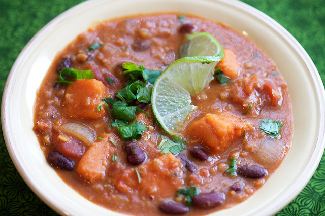

### [Red Lentil Thai Chili](http://www.theppk.com/2010/12/red-lentil-thai-chili/)

#### by IsaChandra

Serves 10 to 12

Active time: 15 minutes || Total time: 40 minutes

You know those food magazines that you flip through while in the checkout line at the supermarket? The ones you put back on the rack, all the better for knowing that you can make a casserole out of a can of soup and 35 egg whites? Yeah, well, I buy those magazines. All of them. It is my secret shame.

But this week a magazine cover gave me the chutzpah to do what I’ve always wanted to… put Thai red curry paste in everything. Or at least chili! To be fair, the magazine was Clean Eating, which usually has pretty awesome non-soup can ideas. And the original recipe was even vegan, so yay.

This isn’t their exact recipe, I just ripped off the idea (jeez, I have _some_ integrity). It’s just as awesome as you would imagine if you threw together a Thai curry and a chili. OK fine, maybe that doesn’t sound awesome, but it was! I used red lentils for texture and kept the main ingredients as is: sweet potatoes and big meaty kidney beans. It’s really satisfying and blessedly easy so make it the next time you want to switch up your chili repertoire. It makes a lot so freeze the leftover and have chili whenever you want.

**Olive oil (1 teaspoon to 2 tablespoons, however much you feel like using)

1 large yellow onion, diced medium

1 red bell pepper, seeded and diced medium

3 cloves garlic, minced

2 tablespoons chili powder

1 ½ lbs sweet potatoes cut into ¾ inch chunks

1 cup red lentils

1 teaspoon salt

4 cups vegetable broth

2 15 oz cans kidney beans, drained and rinsed

2 tablespoons Thai red curry paste

1 15 oz can lowfat coconut milk

28 oz can diced tomatoes

½ cup fresh cilantro, plus extra for garnish

Limes for garnish (optional)**

Preheat a 4-quart pot over medium heat. Saute onions and pepper in oil with a pinch of salt, for 5 to 7 minutes. Add garlic and saute a minute more.

Add chili powder, sweet potatoes, lentils, salt and vegetable broth. Cover and bring to a boil. Let it boil for 15 to 20 minutes, stirring occasionally to prevent burning. When lentils are cooked and sweet potatoes are tender, add the remaining ingredients and heat through.

Taste for salt and seasoning, top with cilantro and lime and serve!
